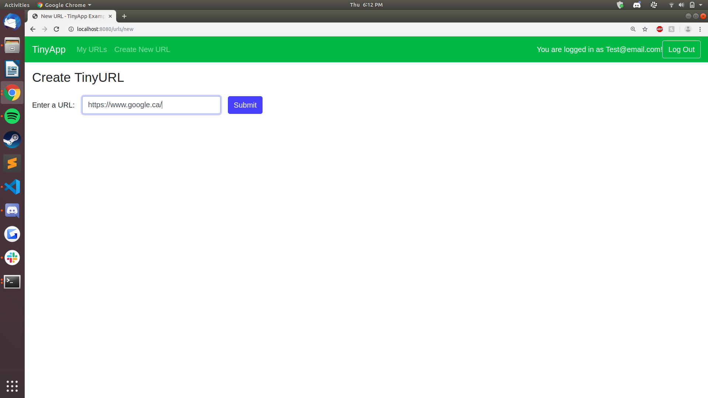

# TinyApp Project

TinyApp is a full stack web application built with Node and Express that allows users to shorten long URLs (à la bit.ly).

## Final Product

## Dependencies

- Node.js
- Express
- EJS
- bcrypt
- body-parser
- cookie-session

## Getting Started

- Install all dependencies (using the `npm install` command).
- Run the development web server using the `node express_server.js` command.
- You will be prompted to register an account immediatley.
- After you do so click "Create New URL" at the top left.
- Edit the URL if you would like and then either click the shortened URL or head back to My URLs to view your other shortened links / their stats.

** TO DO - Create a button to have the user click to copy the shortened URL to the clipboard for easier sharing.